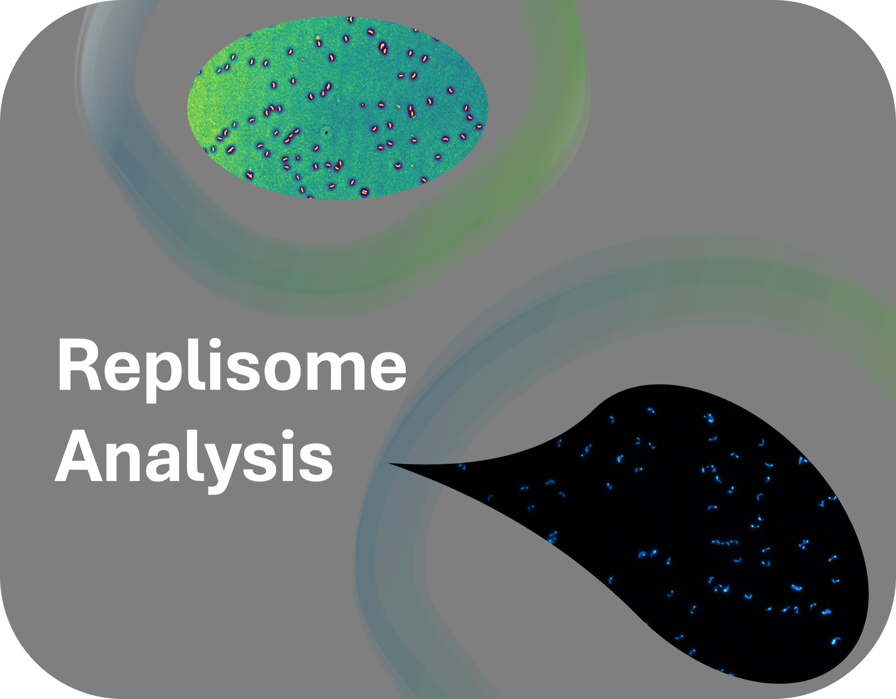

# Replisome Analysis : ImageJ plugin for the analysis of DNA replication dynamics in bacteria

Welcome to the Replisome Analysis Plugin.

## Installation and usage documentation

You can find information on how to use the plugin in the [Documentation](https://c-achard.github.io/bioimage-informatics-BIO410-project/).

## Data availability

Data is available on OMERO at the following link: [Project on OMERO](https://omero.epfl.ch/webclient/?show=project-2857).

## Authors

- Mathilde Morelli
- Cyril Achard
- Linkai Dai