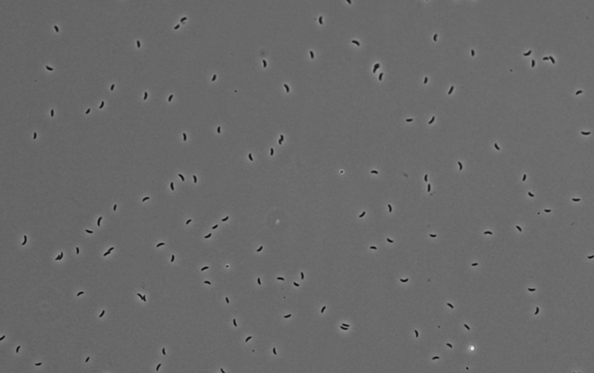
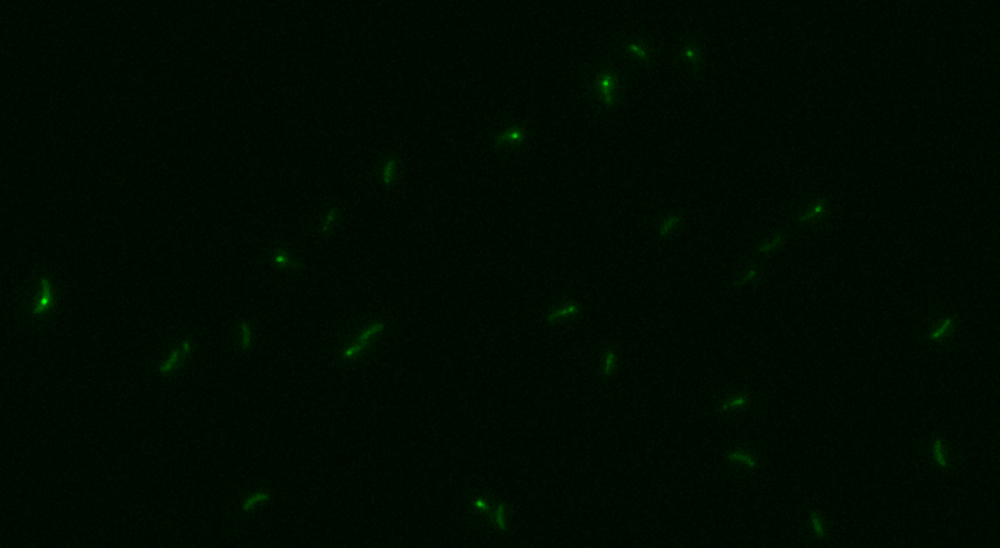

# Replisome Analysis : ImageJ plugin for the analysis of DNA replication dynamics in bacteria

## Welcome to the Replisome Analysis Plugin :material-hand-wave:

This ImageJ plugin is intended to provide an automated analysis of DNA replication dynamics in bacteria.

## Intended Use

This plugin works for 2D+t images of bacteria, specifically via differential interference contrast (DIC) microscopy for the bacterial bodies, and a fluorescent channel. 
The plugin is designed to analyze the dynamics of DNA replication in bacteria, specifically the movement of the replisome.

[//]: # (![Example of DIC channel]&#40;resources/images/DIC_example.png&#41;)

[//]: # (*Example of the bacteria in the DIC channel*)

  
   
  <i>Example of the bacteria in the DIC channel</i>

Bacteria are assigned to colonies using the DIC channel, and GFP-tagged DNaN in the second channel is used to track the replisome. The plugin can be used to track the movement of the replisome.

[//]: # (![Example of GFP channel]&#40;resources/images/GFP_example.png&#41;)

[//]: # (*Example of the replisome foci, tagged with GFP*)

  
   
  <i>Example of the bacteria in the GFP channel</i>

Various plots and statistics can then be generated from the data.

## Hardware requirements

The plugin is designed to work with 2D+t images of bacteria.
Due to the size of the images, a computer with at least 8GB of RAM is recommended; 16GB is preferred.

!!! note
    If you consistently run out of memory, you may want to adjust the memory setting in ImageJ.
    Go to Edit>Options>Memory & Threads and adjust the memory settings as needed, using no more than 75% of your available RAM.
    See [this page](https://docs.openmicroscopy.org/bio-formats/5.7.1/users/imagej/managing-memory.html#increasing-imagej-fijis-memory) for more information.

## Installation

!!! note
    Please note that due to the hardware available to us, this plugin has only been tested on Windows.
    Please contact us if you encounter any issues on other operating systems.

### Dependencies

**First, install the following dependencies manually** :

- cilj2 : due to the GPU acceleration provided by clij, it is safer to instal it from source to ensure there are no drivers issues. 
  Follow [this link](https://clij.github.io/clij2-docs/installationInFiji) to install clij2 in Fiji.
- commons-csv : download the **1.8** version from [here](https://archive.apache.org/dist/commons/csv/binaries/) and place the .jar in the `plugins/` folder of your ImageJ installation.
- xchart : download the **3.8.8** version [here](https://knowm.org/open-source/xchart/xchart-change-log/) and place the .jar in the `plugins/` folder of your ImageJ installation.

!!! warning
    Make sure to install the dependencies before installing the plugin, with the correct versions.
    The plugin may not work if you use the latest version of commons-csv.

### Install from .jar file

To install the plugin, take the provided .jar file in GitHub Packages and place it in the plugins folder of your ImageJ installation.

The plugin will then be available in the ImageJ menu under Plugins > Replisome Analysis.

## Usage

For information on how to use the plugin, see the [Plugin Usage](plugin_usage.md) page.

## Troubleshooting

### Out of memory issues

The most common issue with the plugin is running out of memory. 
If you encounter this issue, you can increase the memory available to ImageJ, or try running the workflows separately.

!!! warning
    **Memory issues**:
    If you consistently run out of memory, you may want to adjust the memory setting in ImageJ.
    Go to Edit>Options>Memory & Threads and adjust the memory settings as needed, using no more than 75% of your available RAM.
    See [this page](https://docs.openmicroscopy.org/bio-formats/5.7.1/users/imagej/managing-memory.html#increasing-imagej-fijis-memory) for more information.

See the [Plugin Usage](plugin_usage.md) page for more information on running the plugin.

### Class not found issues

If you do not install clij2 manually, you may face some ClassNotFound issues.
To solve this, install clij2 manually and restart ImageJ.
Additionally, make sure all the dependencies are correctly installed.

### GUI window too big 

If, when launching the plugin, the GUI window is too big (this can happen on a 13 inches screen), and you cannot see the path browser or the OK button, 
**decrease the GUI scale to ~ 0.7** and **change the Menu font size to 18 points** in ``Edit > Options > Appearance...``
This will allow you to see the full window and use the plugin.

## Data availability

### OMERO

The plugin is designed to work with 2D+t images of bacteria.
This version is intended to run only on the data available [on OMERO](https://omero.epfl.ch/webclient/?show=project-2857).

### Used images

The images used in this plugin are :

- *Merged-1.tif*
- *Merged-2.tif*
- *Merged-3.tif*

Specifications:

- 2D + time, with 1s frame interval
- 60x 1.4 NA oil objective, 103 um/pixel
- 2 channels :
    - Channel 1 : Phase contrast (DIC), Bacteria morphology
    - Channel 2 : Fluorescence, replisome foci (sfGFP Fluorescent protein)

